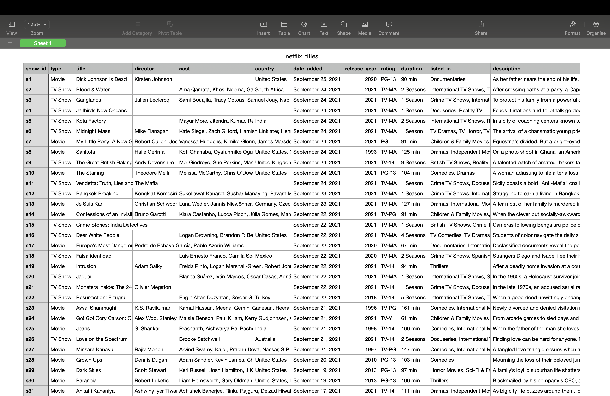
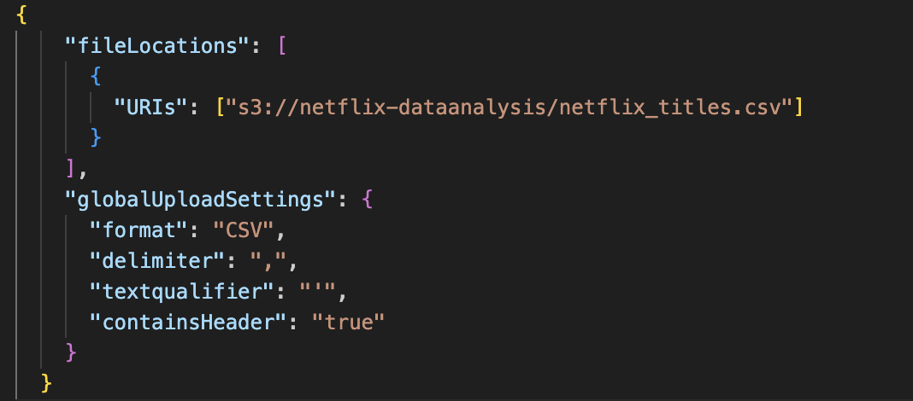
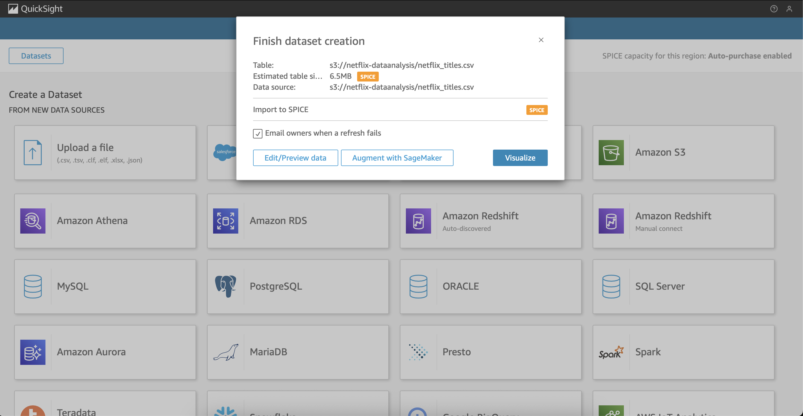
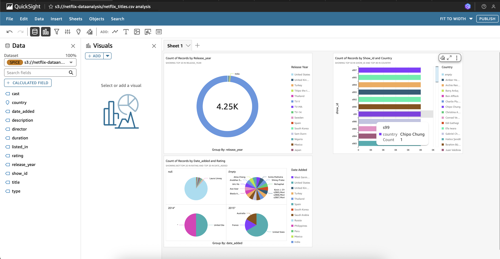

<h2 align="center"> Namaste!🙏🏻 </h2>

<h3 align="center"> Boring .csv files? Not anymore! Built a full-fledged visual dashboard powered by AWS 🚀 </h3>

---
<h3> Project Overview </h3> 

Services Used:
- 🪣 Amazon S3 (for storing CSV files)  
- 📈 Amazon QuickSight (for visualizing the data)

 

### 🔍 What I Learned:
- Storing and organizing datasets using **Amazon S3**
- Creating a **manifest file** to connect S3 with QuickSight
- Designing visuals with filters, KPIs, and charts
- Understanding data storytelling and dashboarding basics

 

## 📋 Checklist: What to Do & Remember

Step 1: Prepare the Dataset
- Try to use excel or google sheets
- Name the file as `sample-filename.csv`
  
 

Step 2: Upload dataset to S3 bucket
- Create a s3 bucket
- Upload the dataset
- Enable versioning (for future use)
    

*Multiple datasets can be used from different s3 buckets and manifest files.* 
  

Step 3: Create a manifest file for quicksight 
- Like this

   
 

Step 4: Create QuickSight Dashboard
- Create quicksight account carefully (untick all unneccessary option to avoid extra costing)
- Go the datasets, then new datasets.
- Select S3, Provide 'data source' and 'manifest file' (Upload or through S3 url)
- Visualize
 
  
  
 

**And Tadaaa.. QUICKSIGHT is all ready!** 
 

Step 4: Build Visuals
- Select all the parameters 
- Charts: Sales by Region, Category-wise Performance, Time Series Trend
- Filters: Region, Product, Date Range
- KPIs: Total Sales, Highest Category
- Add drill-downs and interactivity to stand out!
 
  
  

 

*Can Import data later-on add calculated fields too for further computations*

 
